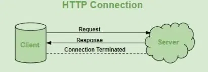

Write a blog on Difference between HTTP1.1 vs HTTP2 :-

HTTP:-

    => HTTP stands for "Hypertext Transfer Protocol".

    => It is used in client-server communication.

    => By using HTTP user sends the request to the server & the server sends the response to the user.

    => HyperText is the type of text that is specially coded with the help of some standard coding language called HyperText Markup Language (HTML).

HTTPS :-

    => Hypertext transfer protocol secure (HTTPS) is the secure version of HTTP, 
    
    => which is the primary protocol used to send data between a web browser and a website. 
    
    => HTTPS is encrypted in order to increase security of data transfer.

    => HTTPS uses an encryption protocol,The protocol is called Transport Layer Security (TLS), although formerly it was known as Secure Sockets Layer (SSL). 
    
    => This protocol secures communications by using what’s known as an asymmetric public key infrastructure. 
    

How does HTTP & HTTPS work?

    => HTTP and HTTPS are used to send data from a browser to a web server. The diagram below shows how they are used.

An Overview Of HTTP :-

    => HTTP is a protocol for fetching resources such as HTML documents. 

    => It is the foundation of any data exchange on the Web and it is a client-server protocol, which means requests are initiated by the recipient, usually the Web browser. 
    
    => A complete document is reconstructed from the different sub-documents fetched, for instance, text, layout description, images, videos, scripts, and more.

    => The messages sent by the client, usually a Web browser, are called requests and the messages sent by the server as an answer are called responses.

History of HTTP :-

Tim Berners Lee and his team at CERN get credit for inventing original HTTP and associated technologies.

Difference Between HTTP/1.1 & HTTP/2 :-

HTTP/1.1 :-

    => It works on the textual format

    => It compresses data by itself.

    => It uses requests resource Inlining for use     getting multiple pages

    => There is head of line blocking that blocks all the requests behind it until it doesn’t get its all resources.

    => In HTTP/1.1, this was easy, as head-of-line blocking made it simple to load various assets in the correct order.

HTTP/2 :-

    => It works on the binary protocol.

    => It uses HPACK for data compression.

    => It uses PUSH frame by server that collects all multiple pages

    => It allows multiplexing so one TCP connection is required for multiple requests.

    => In HTTP/2, this was solved using priority sends in the request (so need to multiple calls) based on the priority you will receive a response in corresponding order.

Advantages of HTTP :-

    => Memory usage and CPU usage are low because of fewer simultaneous connections.

    => Since there are few TCP connections hence network congestion is less.

    => The error can be reported without closing the connection.

    =>HTTP allows HTTP pipe-lining of requests or responses.

Disadvantages of HTTP :-

    => HTTP requires high power to establish communication and transfer data.

    => HTTP is less secure because it does not use any encryption method like HTTPS and use TLS to encrypt regular HTTP requests and response.

    => HTTP is not optimized for cellular phones and it is too gabby.

    =>HTTP does not offer a genuine exchange of data because it is less secure.

